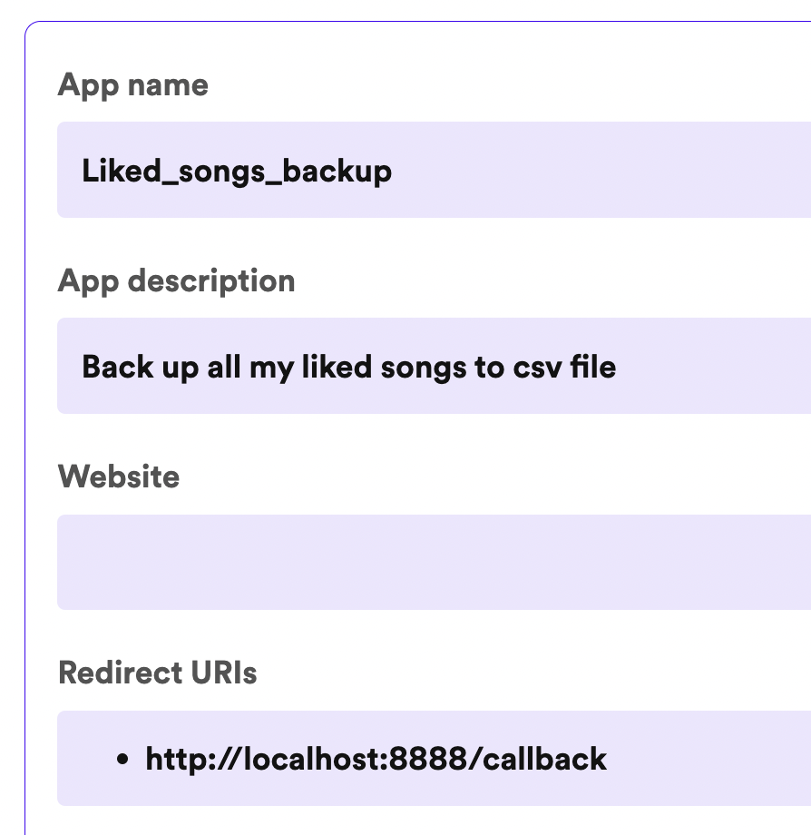

# Spotify backup

## Description

This program saves a .csv file with the names and artists of all the songs saved in Spotify liked songs library. No more anxiety about accidental loss of all those meticulously accumulated songs.

## Getting Started

### Dependencies

- Spotify access token
- Python 3.11.5
- Spotipy 2.23.0
- Pandas 2.0.3
- Made for MacOS, untested on Windows

### Use

1. Create an app on Spotify to get credentials for access token <a href="https://developer.spotify.com/documentation/web-api">Spotify Web API</a>
2. Set the redirect URI in your app settings to: 'http://localhost:8888/callback'


3. Install the required dependencies using
```
pip install -r requirements.txt.
```
5. Run the setup.py file to create a .env file
```
python3 setup.py
```
7. Fill the .env file in with your Client ID and secret
```
SPOTIPY_CLIENT_ID =
SPOTIPY_CLIENT_SECRET =
SPOTIPY_REDIRECT_URI = 'http://localhost:8888/callback'
```
6. Run the program
```
python spotify_backup.py
```
4. Input username
5. File will save as mysongs_[todays date].csv

